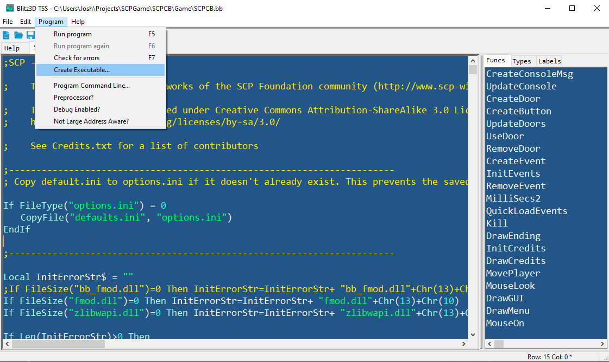
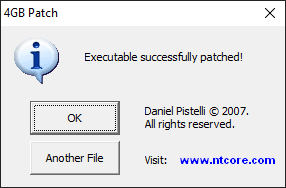
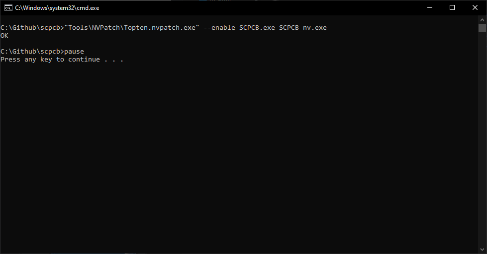

# SCP - Containment Breach

The game is based on the works of the SCP Foundation community (http://www.scp-wiki.net/).

This game and the source code are licensed under Creative Commons Attribution-ShareAlike 3.0 License.

http://creativecommons.org/licenses/by-sa/3.0/

Beware - the source code is perhaps more horrifying than the game itself!

## Compiling the Game

These instructions will teach you how to install and run everything you need to compile the game.

First, download the contents of the game's source code repository here:
https://github.com/Leadwerks/scpcb

### Install Blitz3D

To install Blitz3D, just extract the contents of the zip archive "Tools\Blitz3D.zip" to the location "C:\Program Files (x86)\Blitz3D".

### Compiling

1. Open the Blitz3D IDE by launching the program Blitz3D.exe.
2. In the IDE, open the file "SCPCB.bb".
3. Click the **Program** menu and make sure the **Debug Enabled?** menu item is deselected. This will ensure that you create a release build instead of a slower debug build.
4. Select the **Program > Create Executable** menu item to compile the game. You must have the file SCPCB.bb selected in the tabbed panel when you do this, as the selected file is used to indicate the main file to start compiling with.
5. After you have followed these steps a message will appear saying that the executable was created successfully.

## Post-compile Processing

Before you distribute the executable, there are three steps you should follow to modify it. Your changes MUST be performed in the order specified below, or some of them may be erased by other tools in the chain.

## Replace Icon (optional)

If you have [Resource Hacker](https://www.angusj.com/resourcehacker/) installed you can use it to change the program's icon from the default Blitz3D rocket icon to the SCP icon. If Resource Hacker is installed in the location "C:\Program Files (x86)\Resource Hacker" then you can just run **ReplaceIcon.bat**, and it should display a message that says "Success!".

Resource Hacker also has a visual interface you can use to replace the icon, but if you are performing this action repeatedly, a .bat file will be faster.

## 4 GB Patch (Recommended)

You should run the 4 GB patch tool to increase the amount of memory the application can use (it will need it). Run the program **Tools\4gb_patch.exe** and select SCPCB.exe to patch the executable. This will overwrite the original file. You will see a message indicating the program was successfully patched, but there will be no other visible change:

## NVPatch (Recommended)

The Blitz3D renderer is based on DirectX 7, which was released in 1999. Although there is nothing technically wrong with DirectX 7 or the Blitz renderer, the reality is that modern graphics drivers have very poor support for this API. Additionally, there is a hard-coded screen size limitation that prevents the renderer from displaying on resolutions higher than 2048x1152.

To solve this problem, our build uses [WineD3D for Windows](https://fdossena.com/?p=wined3d/index.frag).to translate all of the game's DirectX7 calls into OpenGL, which has better driver support. Based on the same technology as Valve's Proton, this ensures that the game remains free and open-source for all developers to access. This solution can be used for all versions of the game, not just ours. To enable WineD3D for Windows just copy these two files into your game directory:
- ddraw.dll
- wined3d.dll

Laptop computers often use "switchable graphics", with an integrated graphics chip built into the CPU for simple 2D drawing, and a discrete GPU for games. The problem is that by default, any OpenGL application will use the integrated graphics chip. There's a way to do this with programs written in C, but Blitz has its own compiler and does not support this feature.

**NVPatch** will patch the executable to add information that tells Windows that the game should be run with a discrete GPU, if one is available. This works for both Nvidia and AMD GPUs.

If you don't apply the NVPatch tool to you executable, the game will try to use integrated graphics when it runs on a laptop with switchable graphics.

To patch the executable, just run the **NVPatch.bat** file. If the tool works you will see a message that says OK.

You might see a message that the .NET runtime 8.0.24 runtime is not installed. If this happens, download and install this file from Microsoft: https://aka.ms/dotnet-core-applaunch?framework=Microsoft.NETCore.App&framework_version=8.0.0&arch=x64&rid=win-x64&os=win10

Once you run these patch tools, in the order specified above, your executable will be ready to deploy.
